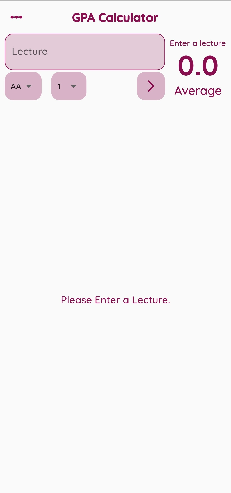
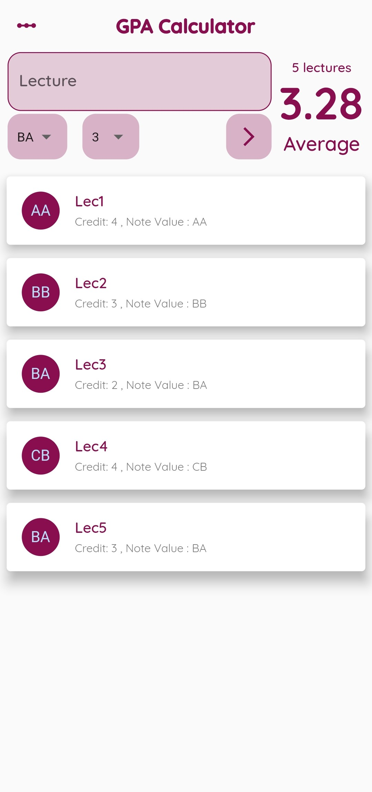
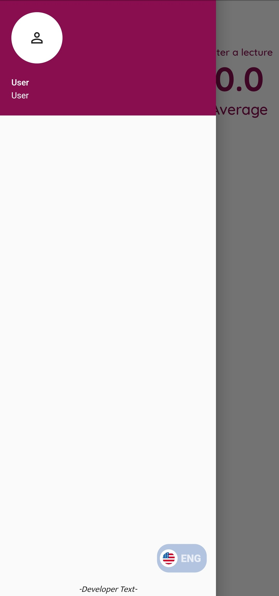
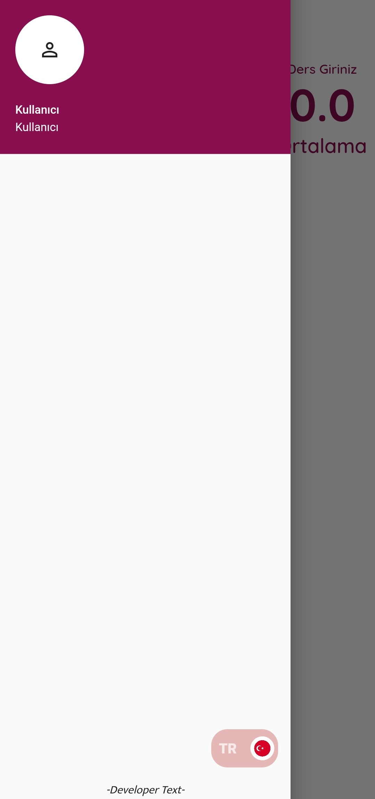
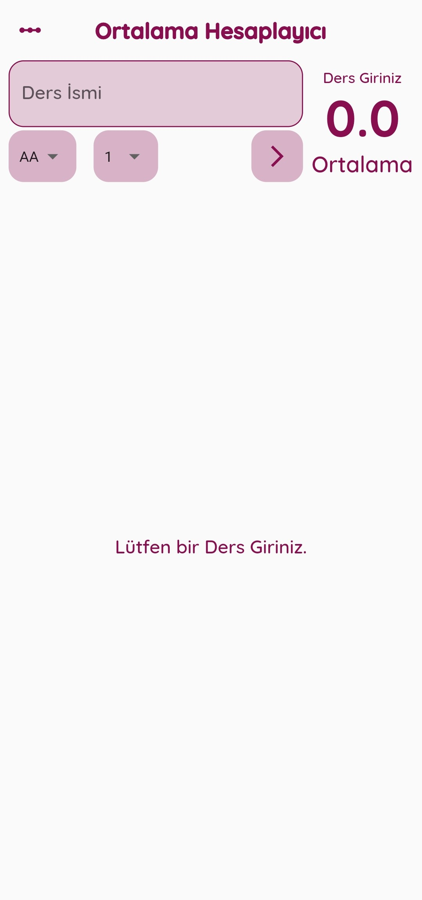

# GPA Calculator
+ I am eager to represent to you my first Dart Project that helps you to calculate your GPA Score.

## Project Looks
+ This is how main page looks. *Simple yet Effective.*

  
 
## Usage
+ You can easily input your Scores by choosing the *Score* & *Credit* and writing *Lecture Name*.
+ Enter button automatically puts the new Lecture into the list and includes new Lecture for calculations.

  
+ After that, *Number of Lecures* and *Average Score* are calcuated and shown at the top right side of the screen.
+ Also you can see, edit or delete previous *Lectures*.

## Additional
+ You can switch the language of the app between English and Turkish via switch button in the *User Page*
+ Even though *User Page* is not %100 completed, feature works perfectly.

### Example of mentioned situation 

> *English version of the App* Screenshots are below.

     
  
> *Turkish version of the App* Screenshots are below.

     

